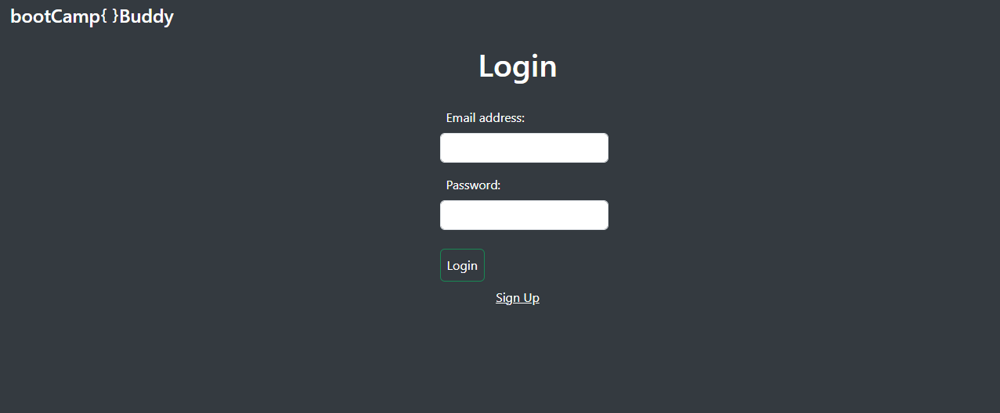

# Bootcamp Buddy

## Table of Contents

- [Motivation](#motivation)
- [UserStory](#userStory)
- [Instructions](#instructions)
- [Installation](#installation)
- [Usage](#usage)
- [License](#license)
- [Contributors](#contributors)

## Motivation

As a group of Bootcamp students trying to learn Full Stack coding from the ground up,
one of the hardest and most time-consuming obstacles is finding resources and tutorials that aid in the learning process.

## UserStory

- This application aims to help us and others who are interested in finding resources on HTML, CSS, JavaScript, Node.js, and Express.js in a more streamlined fashion. 
- Time is valuable, and running into brick walls while researching and learning to code makes learning very difficult. We hope this site makes it easier and less frustrating to learn. 

## Instructions

- Once a new user has created an account, or has an account, and is logged in at the HOME page  https://bootcamp-buddy.onrender.com , they will be redirected to the Subjects page and will be able to select different subjects, such as HTML, CSS, JavaScript etc. Once the user has selected a subject, there will be various links and documents that refer to that subject.

## Installation

* Nothing to install works on a Browser via Link above.

## Usage

* Usage is intended for anyone interested in coding.

  ## License
This application is licensed under the MIT license.

## Contributors 

- Alex Engelsgjerd, 
- Arnaud Tiam, 
- Scott Storkel
- Uriel Blanco
For any contritution you can fork: https://github.com/atengelsgjerd/Bootcamp-Buddy

## Questions
For any correction/ contribution, please find the source code on https://github.com/atengelsgjerd/Bootcamp-Buddy. 
For any questions, please reach out to any of us on:
-arnaudtiam50@gmail.com
-atengelsgjerd@gmail.com
-sstorkels@netzero.net
-uriel.techgzz@gmail.com