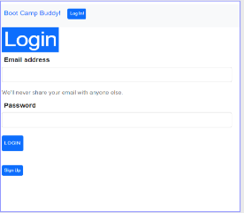

# Bootcamp Buddy

## Table of Contents

- [Motivation](#motivation)
- [UserStory](#userStory)
- [Instructions](#instructions)
- [Installation](#installation)
- [Usage](#usage)
- [Contributors](#contributors)

## Motivation

•	As a group of Bootcamp students trying to learn Full Stack Coding, from the ground up
One of the hardest and most time-consuming obstacles was finding resources and tutorials, that would aid in the learning process.

## UserStory

-	To help us and others who are interested in finding resources on HTML, CSS, JavaScript, Node.js, Express.js, in a more streamlined fashion. 
- Time is valuable and running into Brick Walls when researching and learning to CODE, makes learning very difficult, we hope this site makes it easier and less frustrating to learn. 

## Instructions

•	Once a new user has created an account or has an account and is logged in at the HOME page  https://bootcamp-buddy.onrender.com , will be redirected to the Subjects Page and be able to select different Subjects such as HTML, CSS etc. once the person has selected a subject there will be various links and documents that refer to that subjects such as HTML, CSS etc.

## Installation

* Nothing to install works on a Browser via Link above.

## Usage

* Usage is intended for anyone interested in Coding.

## Contributors 

- Aidan Brennan-Law, 
- Alex Engelsgjerd, 
- Arnaud Tiam, 
- Scott Storkel
